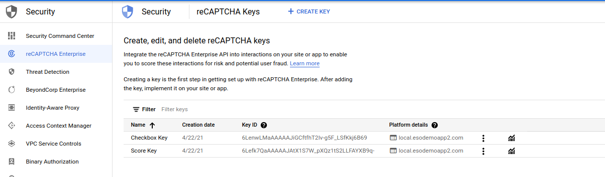
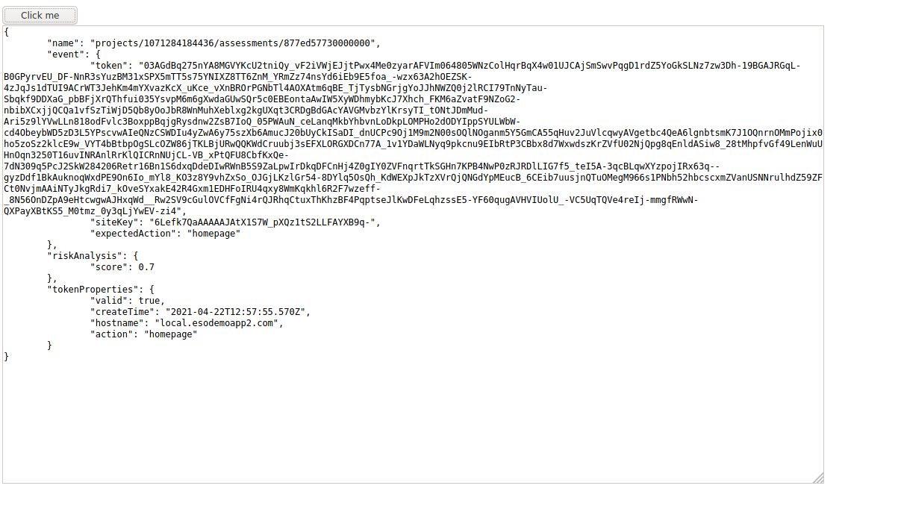
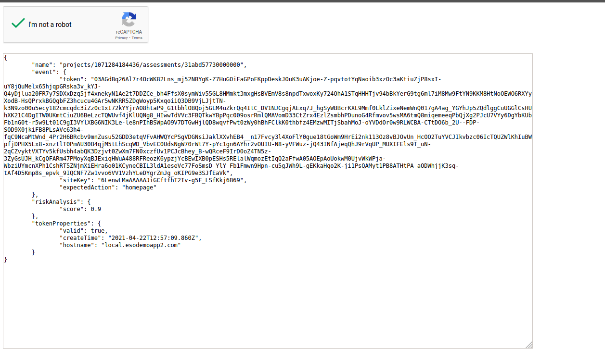
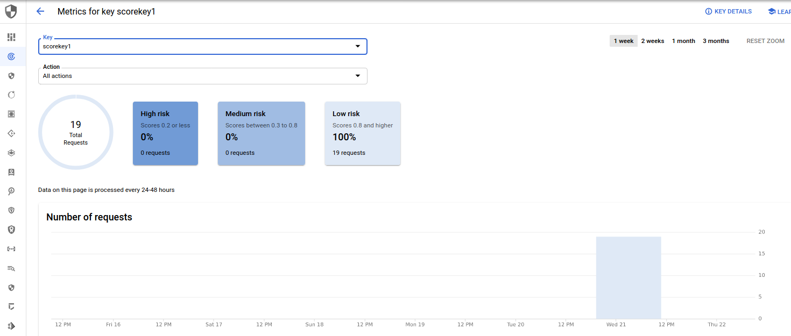
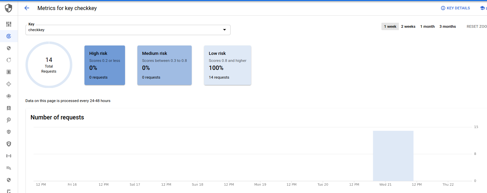

## Simple reCaptcha site

Trivial [reCaptcha](https://cloud.google.com/recaptcha-enterprise/docs/overview) single page "app" that validates and displays the score associated with a user for:

- Scoring 
- Checkbox

Basically, you will setup recaptcha and run a simple golang https webserver that will perform basic recaptcha functions. 

The steps here are

1. enable recaptcha api
2. create service account key
3. assign service account IAM permissions for roles/recaptchaenterprise.agent
4. create recaptcha site keys
5. add keys to page
6. start webserver
7. check if you're a robot

---

### Steps 1->3

```bash
export PROJECT_ID=`gcloud config get-value core/project`
export PROJECT_NUMBER=`gcloud projects describe $PROJECT_ID --format='value(projectNumber)'`

gcloud services enable recaptchaenterprise.googleapis.com

gcloud iam service-accounts create recaptcha-client-account --display-name "recaptcha site Service Account"

gcloud iam service-accounts keys create recaptcha-svc.json --iam-account=recaptcha-client-account@$PROJECT_ID.iam.gserviceaccount.com

gcloud projects add-iam-policy-binding $PROJECT_ID \
       --member serviceAccount:recaptcha-client-account@$PROJECT_ID.iam.gserviceaccount.com   \
       --role roles/recaptchaenterprise.agent
```

> note, i'm downloading a service account key here just as a demo...normally, you should try to _not_ distribute keys if you can help it.  For more info, see [Service Account Best Practices](https://cloud.google.com/iam/docs/best-practices-for-securing-service-accounts)

### Step 4

Now create keys for "scoring" and "checkbox" as described [here](https://cloud.google.com/recaptcha-enterprise/docs/keys)

```bash
gcloud alpha recaptcha keys create \
  --web \
  --display-name="Score Key"  \
  --integration-type=SCORE \
  --domains=local.esodemoapp2.com

gcloud alpha recaptcha keys create \
  --web \
  --display-name="Checkbox Key"  \
  --integration-type=CHECKBOX \
  --domains=local.esodemoapp2.com
```



Note, the host `local.esodemoapp2.com` resolves to `127.0.0.1` and is used to communicate to your local webserver which we will run later


### Step 5

Edit `static/score.html` and place the value for the scoring key into the following sections

```javascript
          <script src="https://www.google.com/recaptcha/enterprise.js?render=6Lefk7QaAAAAAJAtX1S7W_pXQz1tS2LLFAYXB9q-"></script>

          <script>
            function recaptcha_call() {
              grecaptcha.enterprise.execute('6Lefk7QaAAAAAJAtX1S7W_pXQz1tS2LLFAYXB9q-', {action: 'homepage'}).then(function(token) {
                   console.log(token);
```

Edit `static/checkbox.html` and place the value for the check key into the following sections

```javascript
          <div class="g-recaptcha" data-callback="recaptcha_callback" data-sitekey="6LenwLMaAAAAAJiGCftfhT2Iv-g5F_LSfKkj6B69"></div>
```


### Step 6

Edit `httpserver/server.go` and apply the appropriate const values (eg, the keys, the projectID you are using and the absolute path to the svc-account you created) 

```golang
const (
	saFile = "/path/to/recaptcha-svc.json"
	checkKey        = "6LenwLMaAAAAAJiGCftfhT2Iv-g5F_LSfKkj6B69"
	scoringKey      = "6Lefk7QaAAAAAJAtX1S7W_pXQz1tS2LLFAYXB9q-"
	assessmentName  = "yourassessmentname"
	parentProject   = "projects/your-project-id"
	recaptchaAction = "homepage"
)
```

Start the server

```bash
go run server.go
```

the server now listens for https traffic on port `:8081`.  We are using a self-signed certificate here so you may want to load/trust this cert on the browser:

If you are using chrome, you should import both the `root-ca.crt` and `tls-ca.crt`...if you don't mind cert warnings, ignore importing


### Step 7

Now open up an incognito window and navigate to 

[https://local.esodemoapp2.com:8081/static/](https://local.esodemoapp2.com:8081/static/)


(you may need to edit `/etc/hosts` and add a line `127.0.0.1 local.esodemoapp2.com` if you have DNS resolution issues)

- For Score:  [https://local.esodemoapp2.com:8081/static/score.html](https://local.esodemoapp2.com:8081/static/score.html)
  ...you'll know what to do....The response that is shown in the client is the raw [Assessment](https://pkg.go.dev/google.golang.org/genproto/googleapis/cloud/recaptchaenterprise/v1#Assessment) returned to the server.  I'm only displaying it back to the client just for demo...normally you do something on the server side with this

  

- For CheckBox:  [https://local.esodemoapp2.com:8081/static/checkbox.html](https://local.esodemoapp2.com:8081/static/checkbox.html)
  Run through the captcha and you should see the actual raw [Assessment](https://pkg.go.dev/google.golang.org/genproto/googleapis/cloud/recaptchaenterprise/v1#Assessment) returned to the server.  I'm only displaying it back to the client just for demo...normally you do something on the server side with this

  


Eventually (maybe a day later?), you will see stats on the key usage, etc





---

Thats it..

---

Now, some errors i ran into

a) kept seeing `INVALID_REASON_UNSPECIFIED`...what it turned out was i was using the wrong key type (v2,v3) (eg, checkbox key for scoring and vice versa)

...and probably more but this is a trivial sample..

